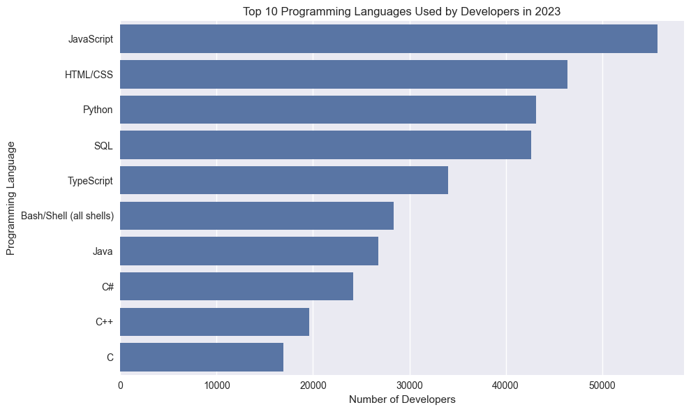
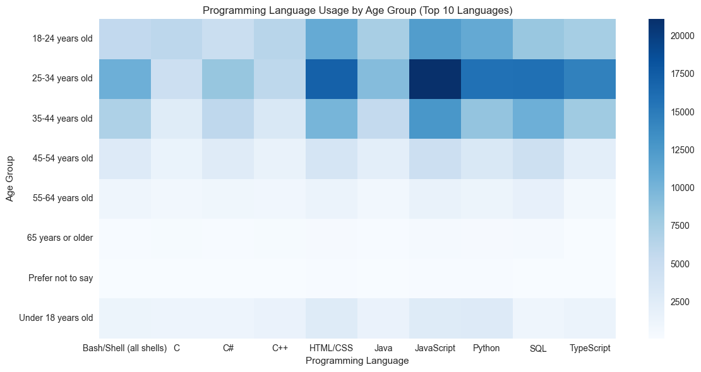
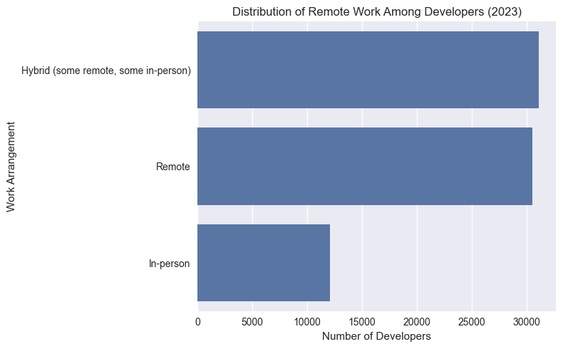
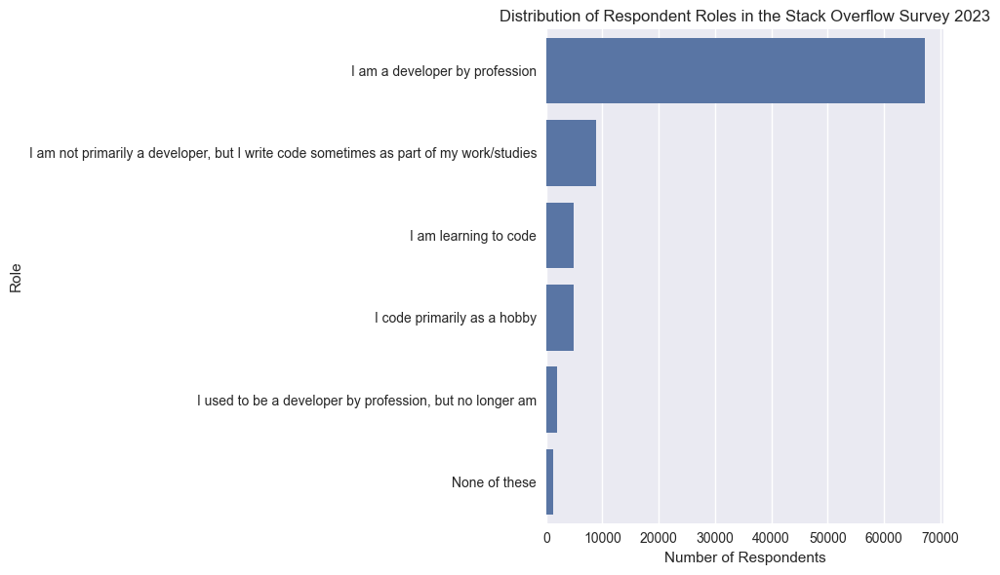

# 📊 Exploratory Data Analysis – Stack Overflow Developer Survey 2023

This project presents an exploratory data analysis (EDA) of the 2023 Stack Overflow Developer Survey,
demonstrating a structured data analysis workflow relevant to data analyst roles.

---

## 📁 Data Source

The analysis is based on the official **Stack Overflow Developer Survey 2023**, which contains
self-reported responses from tens of thousands of developers worldwide.

Files used:
- `survey_results_public.csv` – main dataset
- `survey_results_schema.csv` – description of survey questions
- `so_survey_2023.pdf` – original questionnaire and methodology

---

## ❓ Research Questions

The analysis focuses on the following questions:

1. Which programming languages are most commonly used by developers?
2. How do programming language skills vary by age group?
3. How prevalent is remote work among developers?
4. Are there differences between respondent roles?

---

## 🛠️ Tools & Technologies

- Python
- Pandas 
- NumPy
- Matplotlib
- Seaborn
- Jupyter Notebook
- Visual Studio Code

---

## 🧹 Data Preparation

Instead of cleaning the entire dataset, the analysis focuses on a subset of relevant variables
that directly address the research questions:

- `LanguageHaveWorkedWith`
- `Age`
- `RemoteWork`
- `Employment`
- `MainBranch`

Missing values are handled on a per-analysis basis rather than by globally removing rows,
ensuring that valid data is retained wherever possible.

---

## 📊 Key Findings

- **Python, JavaScript, and SQL** are the most commonly used programming languages among respondents.
- Programming language usage shows noticeable variation across different age groups.
- **Remote and hybrid work** arrangements are widely adopted among developers.
- The survey population is dominated by **professional developers**, followed by students and learners.

---

## 📈 Visuals

### Top Programming Languages (2023)


### Programming Languages by Age Group


### Remote Work Distribution


### Roles Distribution


---

## ⚠️ Limitations

- The data is self-reported and may be subject to response bias.
- Not all survey questions were mandatory, resulting in missing values for some variables.
- The analysis describes distributions and correlations, not causal relationships.

---

## 📂 Project Structure

```text
stack-overflow-eda/
├── data/
│   ├── survey_results_public.csv
│   └── survey_results_schema.csv
├── docs/
│   └── so_survey_2023.pdf
├── images/
│   ├── top_languages_2023.png
│   ├── languages_by_age.png
│   ├── remote_work_distribution.png
│   └── roles_distribution.png
├── notebooks/
│   └── 01_exploratory_data_analysis.ipynb
└── README.md
```
---

## 🚀 How to Run the Project

1. Clone the repository.
2. Install required dependencies.
3. Open the notebook `01_exploratory_data_analysis.ipynb`.
4. Run all cells from top to bottom.

---

## 📌 Summary

This project demonstrates a complete exploratory data analysis workflow, from defining
clear research questions and preparing the data to visualizing insights and documenting
limitations. It is intended as a portfolio project for data analyst roles.
